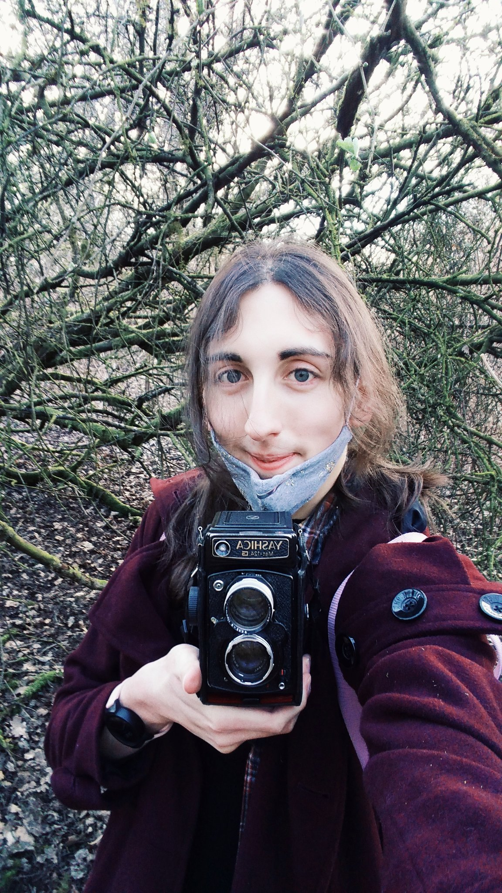

<!--  -->

Hi, I'm Rosie!  (she/her)

<!--  -->
I'm a photographer passionate about keeping traditional, analogue photography practices alive.

I'm a UX designer, a computer networking grad and a web development postgrad.

I'm a multi-instrumental musician. 

I'm passionate about vintage technology and it's preservation.

I'm also multilingual. I have varying levels of skill in many languages, though English, Dutch and Scots are what I am most comfortable communicating in.

If you want to contact me or see what I'm up to:

<a href="https://twitter.com/rosiestquartz_">@rosiestquartz_</a>

<a href=https://mastodon.art/@rosiestquartz>mastodon.art/@rosiestquartz</a>

</i><a href="https://soundcloud.com/rosiestquartz">Rosie</a>

 <a href="mailto:rosie@rosiestquartz.com">rosie@rosiestquartz.com"</a>

